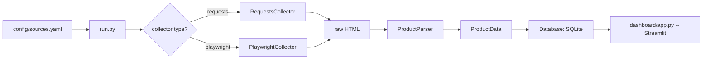

# Tennis Tracker — Project Guide

A small price-tracking scraper for tennis rackets. It downloads product pages from
configured retailers, extracts name/brand/SKU/price/stock-status, stores every
observation in SQLite, and shows the results in a Streamlit dashboard.

This document explains how the whole pipeline works end-to-end, and how to run
every part of it (tests, a full scrape, the dashboard, individual pieces).

---

## 1. How it all fits together



1. [run.py](run.py) reads [config/sources.yaml](config/sources.yaml), which lists every
   retailer ("source") and every product URL to track under it.
2. For each product, it picks a collector based on the source's `collector` setting:
   - `requests` → [src/collectors/requests_collector.py](src/collectors/requests_collector.py) — plain HTTP GET, for
     server-rendered pages.
   - `playwright` → [src/collectors/playwright_collector.py](src/collectors/playwright_collector.py) — a real headless
     browser, for pages that need JavaScript to render product data.
3. The raw HTML goes to [src/parsers/product_parser.py](src/parsers/product_parser.py), which extracts a
   `ProductData` record (name, brand, sku, price, in_stock, scraped_at).
4. That record is saved to SQLite via [src/database/database.py](src/database/database.py), which keeps one
   row per product plus a full history of every price observation.
5. [dashboard/app.py](dashboard/app.py) reads the same database and renders a table of latest
   prices plus a line chart of price history per product.
6. [src/utils/logging_config.py](src/utils/logging_config.py) wires up console + file logging so a scheduled,
   unattended run leaves a record of what happened.

---

## 2. Directory structure

```
tennis-tracker/
├── run.py                        # orchestration entry point (full scrape run)
├── test_requests.py              # ad hoc manual smoke test for RequestsCollector
├── requirements.txt
├── config/
│   └── sources.yaml              # retailers + product URLs + CSS/attribute selectors
├── data/
│   ├── raw/                      # (reserved for raw HTML snapshots, currently unused)
│   └── processed/
│       └── tennis_tracker.db     # SQLite database (created on first run)
├── dashboard/
│   └── app.py                    # Streamlit UI
├── src/
│   ├── collectors/
│   │   ├── requests_collector.py     # RequestsCollector: plain HTTP fetch
│   │   └── playwright_collector.py   # PlaywrightCollector: headless-browser fetch
│   ├── parsers/
│   │   └── product_parser.py         # ProductParser + ProductData + ProductParseError
│   ├── database/
│   │   └── database.py               # Database: SQLite schema + CRUD helpers
│   └── utils/
│       └── logging_config.py         # setup_logging()
└── tests/
    ├── test_product_parser.py    # unit tests for parsing strategies
    └── test_database.py          # unit tests for schema/upsert/history behavior
```

---

## 3. Setup

The project already has a virtual environment at `.venv/`. If you ever need to
recreate it or install/update dependencies:

```powershell
python -m venv .venv
.venv\Scripts\python.exe -m pip install -r requirements.txt
.venv\Scripts\python.exe -m playwright install chromium
```

`requirements.txt` includes: `requests`, `beautifulsoup4`, `lxml` (collectors/parsing),
`playwright` (headless browser collector), `pandas` + `streamlit` (dashboard),
`pyyaml` (config loading), `python-dotenv` (reserved for future secrets/config),
`pytest` (tests).

> Always invoke `.venv\Scripts\python.exe` explicitly (or activate the venv first
> with `.venv\Scripts\Activate.ps1`) so you're not accidentally running a global
> Python interpreter that doesn't have these packages installed.

---

## 4. `config/sources.yaml` — how sources are configured

Each entry under `sources:` describes one retailer. Three sources are configured
today — Tennis Warehouse (attribute-container strategy), Tennis Express and
Holabird Sports (both JSON-LD strategy, since both are Shopify stores):

```yaml
sources:
  tennis_warehouse:
    name: "Tennis Warehouse"
    collector: requests          # requests | playwright
    parser:
      container_selector: "div.desc_top.gtm_detail"
      attributes:
        name: data-gtm_detail_name
        price: data-gtm_detail_price
        brand: data-gtm_detail_brand
        sku: data-gtm_detail_stock_number
      fallback:
        name_selector: "h1.desc_top-head-title"
        price_selector: "[itemprop='price']"
      availability_selector: "[itemprop='availability']"
    products:
      - url: "https://www.tennis-warehouse.com/Wilson_RF_01/descpageRCWILSON-WRF1R.html"

  tennis_express:
    name: "Tennis Express"
    collector: requests
    parser:
      json_ld: true              # read the schema.org Product block instead
    products:
      - url: "https://tennisexpress.com/products/pro-staff-97-classic-tennis-racquet"

  holabird_sports:
    name: "Holabird Sports"
    collector: requests
    parser:
      json_ld: true
    products:
      - url: "https://www.holabirdsports.com/products/wilson-pro-staff-97-classic"
```

- **`collector`** — `requests` for plain server-rendered HTML, `playwright` for
  pages where product data only appears after JavaScript runs.

For each product, `ProductParser` tries these strategies **in order** and stops
at the first one that yields a price:

1. **`parser.container_selector` + `attributes`** — looks for one CSS-selected
   element and reads product fields straight off its HTML attributes. Fast and
   reliable when a site conveniently puts all product data on one element
   (many sites do this for their own analytics/tracking scripts — that's
   exactly what `div.desc_top.gtm_detail` is on Tennis Warehouse).
2. **`parser.json_ld: true`** — scans every `<script type="application/ld+json">`
   block on the page for a schema.org `Product` entry, and reads
   `name`/`brand.name`/`sku`/`offers.price`/`offers.availability` from it.
   `offers` may be a single object or a list of per-variant offers (both are
   handled). This is the most common structured-data pattern on modern
   e-commerce sites, especially Shopify storefronts like Tennis Express and
   Holabird Sports — no CSS selectors to babysit, since the JSON is already
   structured.
3. **`parser.fallback`** — used only if neither strategy above finds anything.
   It looks for a `name_selector` and a `price_selector`, reading the
   element's `content` attribute (schema.org microdata convention) or its text.

- **`availability_selector`** — resolved independently of the strategies above
  *except* JSON-LD (which already carries its own `availability` value), since
  stock-status markup (`itemprop="availability"`) tends to follow the same
  schema.org convention across most e-commerce sites regardless of how the rest
  of the product data is exposed.
- **`products`** — one entry per product URL to track under that source.

### Adding a new source

1. Open the target product page in a browser, open DevTools → Elements/Network,
   and check `view-source:` for a `<script type="application/ld+json">` block
   containing `"@type": "Product"` — if present, just set `parser.json_ld: true`
   and you're done. Otherwise, look for a single data-attribute-rich container,
   or fall back to standard `itemprop="name"/"price"/"availability"` microdata.
2. Add a new entry under `sources:` with whichever strategy applies.
3. Add one or more `products:` URLs.
4. Run `python run.py` and check the log line / query the database to confirm it
   parsed correctly (see §6).

---

## 5. Module reference

### `RequestsCollector` — [src/collectors/requests_collector.py](src/collectors/requests_collector.py)
```python
collector = RequestsCollector(timeout=20)
html = collector.collect(url)   # -> str of page HTML
```
A thin wrapper around `requests.get` with a browser-like `User-Agent` and
`raise_for_status()` so failed fetches surface immediately as exceptions.

### `PlaywrightCollector` — [src/collectors/playwright_collector.py](src/collectors/playwright_collector.py)
```python
with PlaywrightCollector() as collector:      # launches one browser, reused below
    for url in urls:
        html = collector.collect(url)
```
Launches headless Chromium, opens a page, waits for `networkidle`, and returns
`page.content()` (the fully-rendered DOM). Using it as a context manager avoids
relaunching a browser per page — important once you're tracking many products.
It also works without the `with` block (spins up a throwaway browser per call),
so its interface matches `RequestsCollector`.

### `ProductParser` — [src/parsers/product_parser.py](src/parsers/product_parser.py)
```python
parser = ProductParser()
product = parser.parse(html, url, source_cfg["parser"])   # -> ProductData
```
- Tries the container strategy, then the JSON-LD strategy (if
  `parser.json_ld: true`), then the microdata fallback strategy, then raises
  `ProductParseError` if no price could be found at all — this is treated as an
  expected, per-product failure by `run.py` (logged and skipped, not fatal).
- Price values are normalized by `_to_price`: numeric JSON values (`299.00`)
  are used as-is, and text values are normalized with a regex (`PRICE_PATTERN`)
  that strips thousands separators and pulls out the number, so `"$329.00"`,
  `"329.00"`, `"1,299.00"` all parse correctly.
- `ProductData` is a `dataclass` with a `to_dict()` helper.

### `Database` — [src/database/database.py](src/database/database.py)
SQLite database with two tables:
- `products` — one row per unique URL (`url` is `UNIQUE`), holding the latest
  name/brand/sku.
- `price_history` — one row per observation, foreign-keyed to `products.id`,
  storing `price`, `in_stock`, `scraped_at`.

Key methods:
- `save_product_snapshot(source, product)` — upserts the product row, then
  inserts a new price-history row. This is the one method `run.py` calls per
  product.
- `get_latest_prices()` — one row per product, joined to its most recent
  price-history entry. Powers the dashboard's "Latest prices" table.
- `get_price_history(product_id)` — full history for one product, oldest first.
  Powers the dashboard's line chart.

All queries are parameterized (`?` placeholders) — no string-formatted SQL, so
user/scraped data can never be interpreted as SQL.

### `setup_logging()` — [src/utils/logging_config.py](src/utils/logging_config.py)
Configures the root logger once with a console handler and a file handler
(`data/tennis_tracker.log` by default). Call it once at the start of a script
(`run.py` already does this).

### `run.py`
The orchestration script: loads config, creates one `RequestsCollector` and one
`PlaywrightCollector` (used as a context manager for the whole run), loops over
every source and product, and for each one: collect → parse → save → log.
Both expected (`ProductParseError`) and unexpected exceptions are caught
per-product, so one broken page never stops the rest of the run.

### `dashboard/app.py`
A Streamlit page: reads `get_latest_prices()` into a `pandas.DataFrame` for the
overview table, then lets you pick a product from a dropdown and renders its
price history (`get_price_history()`) as a line chart.

---

## 6. Running things

### Run the unit tests
```powershell
.venv\Scripts\python.exe -m pytest -v
```
This covers `ProductParser` (container strategy, JSON-LD strategy with both a
single offer and a list of offers, fallback strategy, and the no-price-found
error case) and `Database` (save/read-back, and that price history accumulates
across multiple snapshots while "latest price" reflects the newest one). These
tests use temp SQLite files and static HTML fixtures — no network access
required, so they're fast and deterministic.

To run just one file or one test:
```powershell
.venv\Scripts\python.exe -m pytest tests\test_product_parser.py -v
.venv\Scripts\python.exe -m pytest tests\test_database.py::test_save_and_read_back -v
```

### Run a full scrape
```powershell
.venv\Scripts\python.exe run.py
```
This hits every URL in [config/sources.yaml](config/sources.yaml) for real, parses each page, and
writes to `data/processed/tennis_tracker.db`. Watch the console (and
`data/tennis_tracker.log`) for one line per product:
```
2026-08-20 02:11:10,476 [INFO] __main__: Saved Wilson RF 01 Racquet: $329.0 (in_stock=True)
2026-08-20 02:23:46,797 [INFO] __main__: Saved Pro Staff 97 Classic Tennis Racquet: $299.0 (in_stock=True)
2026-08-20 02:23:48,099 [INFO] __main__: Saved Wilson Pro Staff 97 Classic: $299.0 (in_stock=True)
```

### Inspect the database directly
```powershell
.venv\Scripts\python.exe -c "from src.database.database import Database; print(Database().get_latest_prices())"
```

### Launch the dashboard
```powershell
.venv\Scripts\python.exe -m streamlit run dashboard/app.py
```
Opens a browser tab with the latest-prices table and a per-product price chart.
Run `run.py` a few times over a few days to build up a real price history to
look at.

### Ad hoc single-collector test
[test_requests.py](test_requests.py) is a scratch script for testing `RequestsCollector` against
one URL directly:
```powershell
.venv\Scripts\python.exe test_requests.py
```

---

## 7. Troubleshooting

- **`ImportError: cannot import name 'X' from ...` even though the file looks
  correct** — usually a stale `__pycache__`. Delete it and retry:
  ```powershell
  Remove-Item -Recurse -Force src\collectors\__pycache__
  ```
  If the problem persists, check the file isn't actually **0 bytes on disk**
  (unsaved editor buffer) with `(Get-Content -Raw path\to\file.py).Length` — if
  it prints `0`, save the file in the editor first.
- **`ModuleNotFoundError` for a package listed in `requirements.txt`** — it was
  never installed in this venv; run
  `.venv\Scripts\python.exe -m pip install -r requirements.txt`.
- **Wrong interpreter** — confirm VS Code / your terminal is using
  `.venv\Scripts\python.exe`, not a global Python:
  ```powershell
  python -c "import sys; print(sys.executable)"
  ```
- **`ProductParseError` during `run.py`** — the configured selectors didn't
  match anything on the page (the site likely changed its markup, or the
  product needs `collector: playwright` instead of `requests` because the data
  is loaded via JavaScript). Re-inspect the page in DevTools and update
  [config/sources.yaml](config/sources.yaml).
